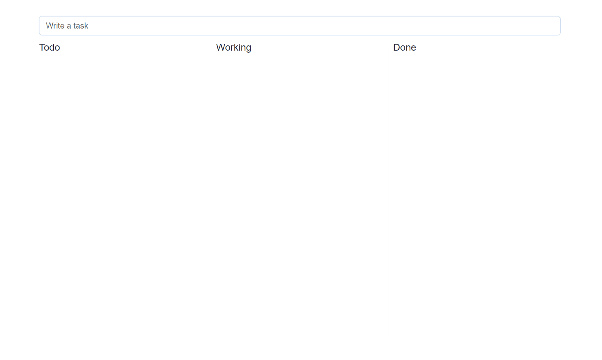

# TASK APP

TASK is a desktop application built with Electron and Express, developed using TypeScript. This project includes a basic structure for a web application with an Express backend and a desktop user interface using Electron.



## Features

- **Backend**: Express.js with TypeScript support.
- **Frontend**: Desktop user interface with Electron.
- **Views**: Using Pug as the templating engine.
- **Build**: Integration with `electron-builder` for packaging the application.

## Project Structure

- `src/`: Source code for the application.
  - `bin/www`: Main entry for the Express server.
- `dist/`: Output folder for TypeScript transpiled files.
- `views/`: Pug view templates.
- `build/`: Resources for the Electron build process.

## Scripts

- `start`: Starts the application in production mode.
  ```bash
  npm start

## Commands

build: Compiles TypeScript code to JavaScript. Run the command with Git Bash

````bash
npm run build
````

dev: Starts the application in development mode using ts-node

````bash
npm run dev
````

electron: Launches the application in Electron mode

````bash
npm run electron
````

build-electron: Builds the Electron application using electron-builder

````bash
npm run build-electron
````